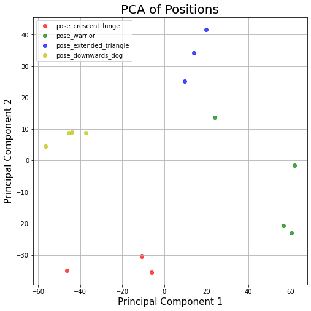
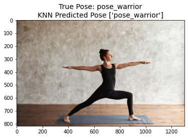
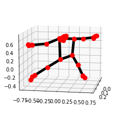
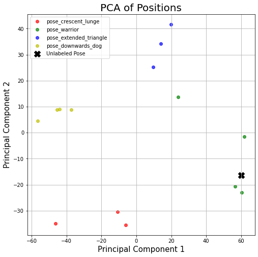
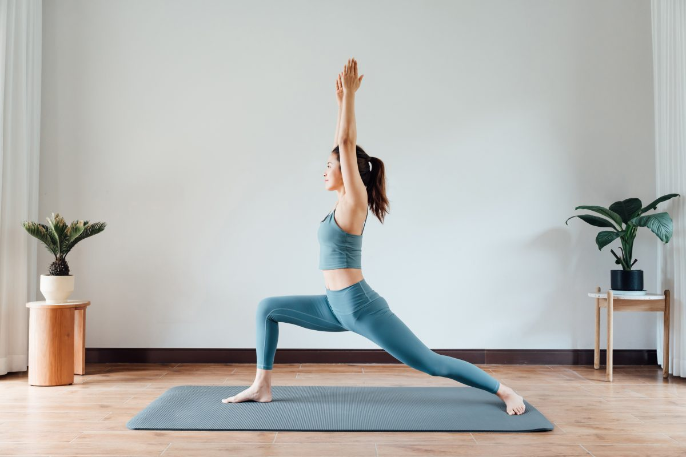
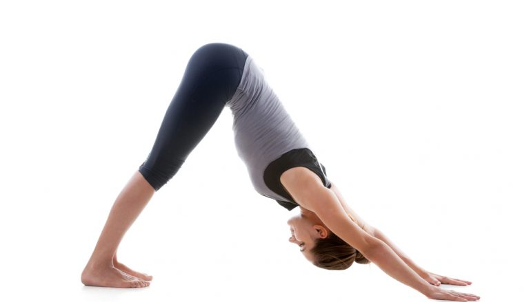
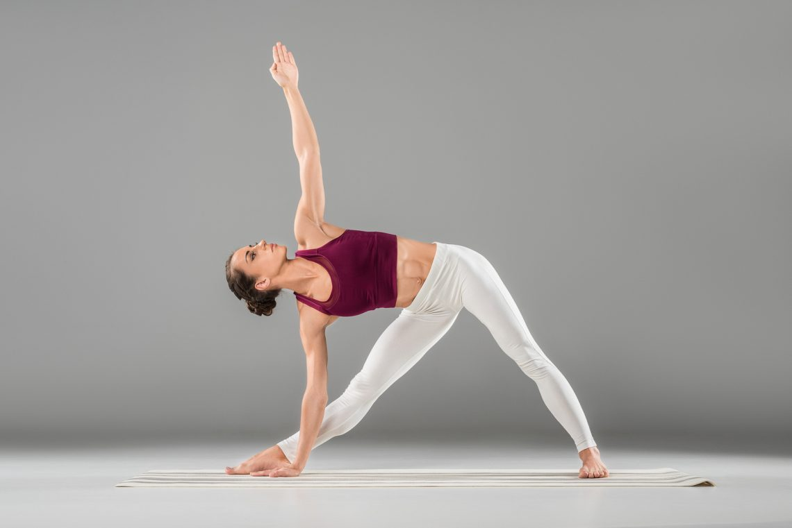
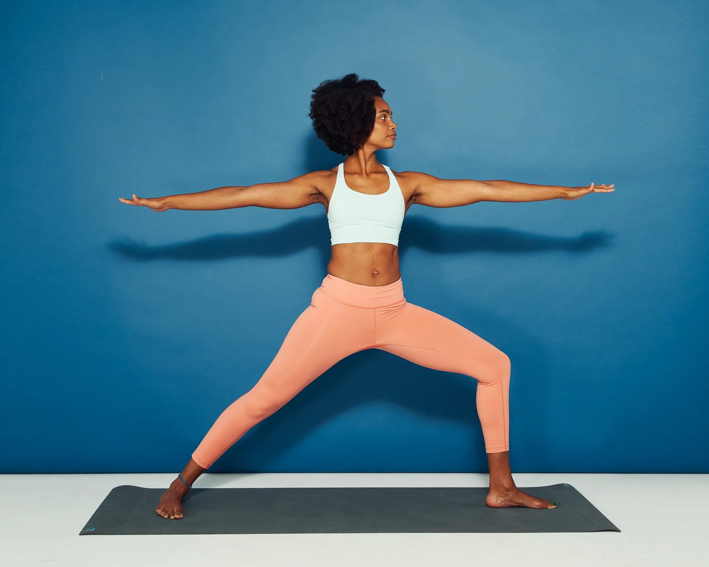

# pose-estimation

#### What is pose estimation
- Pose estimation predicts different poses based on a person’s body parts and joint 
positioning in an image or video.

Use case: This can be useful as we could automatically detect the 
joints, arms, hips, and spine position while performing a squat.

### Project Description:
Create a yoga pose classifier which take in an input image and returns the predicted yoga pose
out of the poses within the training set (see [here](#current-available-yoga-poses))

### Technologies used:
- We use [MediaPipe](https://github.com/google/mediapipe) Holistic model to generate 33 key points features for human pose estimation. See image below
 
- [Principal Component Analysis](https://scikit-learn.org/stable/modules/generated/sklearn.decomposition.PCA.html) (PCA) for feature dimension reduction of the large number of special pose features engineeered from the relationships between components of the Pose Detection Model
- [K-Nearest Neighbors](https://scikit-learn.org/stable/modules/generated/sklearn.neighbors.KNeighborsClassifier.html) to predict the yoga pose according to the closest match using the PCA components.

### Method:
- Compact all training data using PCA to create a 2-dimension plot which neatly segregates the 
yoga poses.
 
- Find the closest matching data from an input image i.e.

- Generate the 33 three-dimension keypoints

- Identify additional angle features of the human pose by calculating the angle between core 
components of the pose. i.e the left armpit angle which used the "left_shoulder", "left_elbow", 
"left_hip" coordinates    
- Transform the set of features to 2D using PCA and find the mode of the 3 nearest neighbours of the
unlabeled input pose

## Results
- 100% accuracy is achieved on a test set of unseen images.

## Improvements:
- Add more yoga poses to the training dataset

#### Current available yoga poses:
- Crescent Lunge

- Downward Dog

- Extended Triangle

- Warrior

